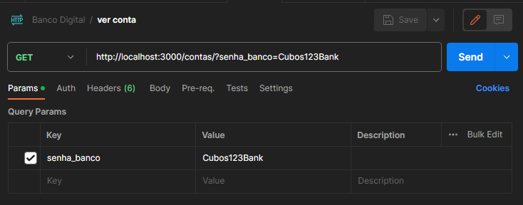
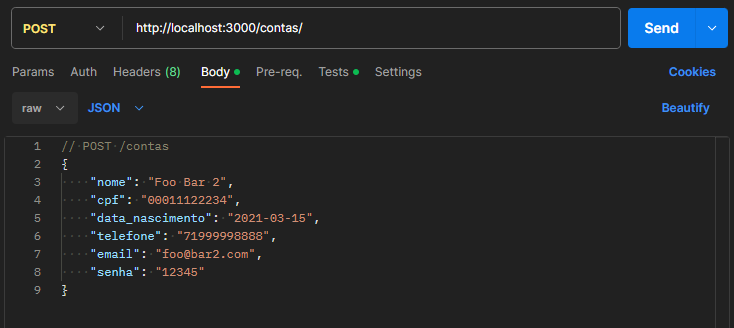
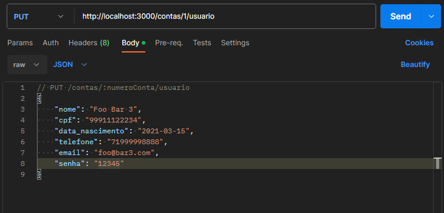
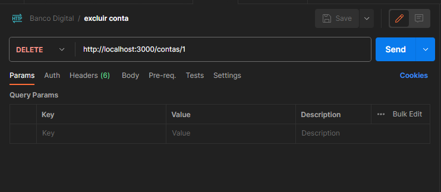
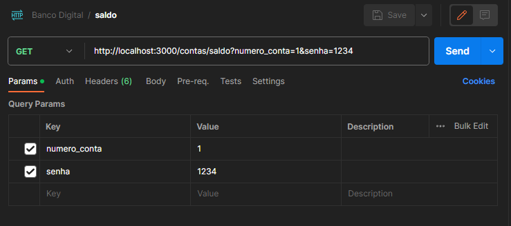
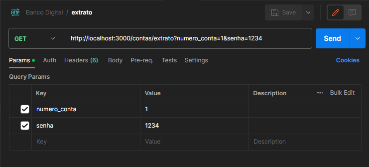
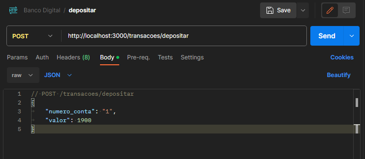
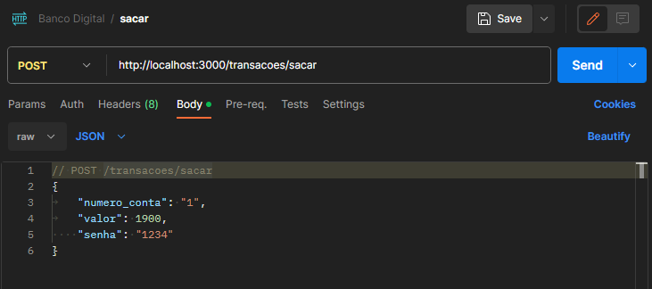
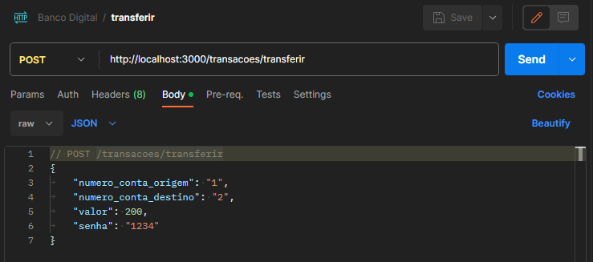

# RESTful API - Banco Digital

Esta é uma API RESTful simples para um banco digital.

## Tecnologias Utilizadas

- **JavaScript**
- **Node.js**
- **Express.js**
- **Postman**
<br>

## Dependências

- [**Express:**](https://www.npmjs.com/package/express) Framework web para Node.js.
- [**date-fns:**](https://www.npmjs.com/package/date-fns) Biblioteca para formatação de datas.<br><br>
**Recomendado:**
- [**nodemon:**](https://www.npmjs.com/package/nodemon) Biblioteca para formatação de datas.
<br>

## Endpoints da API
A API oferece os seguintes endpoints:

``GET`` ``/contas`` Retorna todas as contas.

``POST`` ``/contas`` Cria uma nova conta.

``PUT`` ``/contas/:numeroConta/usuario`` Atualiza os dados de uma conta existente.

``DELETE`` ``/contas/:numeroConta`` Exclui uma conta (com saldo zero).

``GET`` ``/contas/saldo`` Retorna o saldo de uma conta.

``GET`` ``/contas/extrato`` Gera o extrato de uma conta.

``POST`` ``/transacoes/depositar`` Realiza um depósito em uma conta.

``POST`` ``/transacoes/sacar`` Realiza um saque em uma conta.

``POST`` ``/transacoes/transferir`` Realiza uma transferência entre contas.
<br><br>

## Como Utilizar
Certifique-se de ter o Node.js instalado em sua máquina.<br><br>

1. **Clone este repositório:**
  ```
  git clone https://github.com/patrick-carmo/restful-api-banco-digital.git
  ```
<br>  

2. **Navegue até o diretório raiz do projeto:**
  ```
  cd restful-api-banco-digital
  ```
<br>  

3. **Instale as dependências:**

  ```
  npm install
  ```
  ```
  npm init
  ```
  ```
  npm install express
  ```
  ```
  npm install date-fns
  ```
  ```
  npm install -D nodemon
  ```
  <br>

4. **Inicie o servidor:**  

  ```
  npm run dev
  ```
  <br>

5. **Inicie o Postman ou qualquer ferramenta para testar API**<br><br>

## Exemplos para testar as rotas:
- ``GET`` ``/contas``
  ```
  http://localhost:3000/contas/?senha_banco=Cubos123Bank
  ```
  **Requisição** - query params (respeitando este nome)
  - senha_banco
  <br>
  <p align="center"></p>
  
  <br>

- ``POST`` ``/contas``
  ```
  http://localhost:3000/contas
  ```
  
  **Requisição** - O corpo (body) deverá possuir um objeto com as seguintes propriedades (respeitando estes nomes):
  - nome
  - cpf
  - data_nascimento
  - telefone
  - email
  - senha
  <br>

  ```javascript
    // POST /contas
    {
      "nome": "Foo Bar 2",
      "cpf": "00011122234",
      "data_nascimento": "2021-03-15",
      "telefone": "71999998888",
      "email": "foo@bar2.com",
      "senha": "12345"
    }
  ```
  <br>
  <p align="center"></p>
  <br>

- ``PUT`` ``/contas/:numeroConta/usuario``
  ```
  http://localhost:3000/contas/1/usuario
  ```

  **requisição** - O corpo (body) deverá possuir um objeto com todas as seguintes propriedades (respeitando estes nomes):
  - nome
  - cpf
  - data_nascimento
  - telefone
  - email
  - senha
  <br>
    
  ```javascript
  // PUT /contas/:numeroConta/usuario
  {
    "nome": "Foo Bar 3",
    "cpf": "99911122234",
    "data_nascimento": "2021-03-15",
    "telefone": "71999998888",
    "email": "foo@bar3.com",
    "senha": "12345"
  }
  ```
  <br>
  <p align="center"></p>
  <br>

- ``DELETE`` ``/contas/:numeroConta``
  ```
  http://localhost:3000/contas/2
  ```
  Numero da conta bancária (passado como parâmetro na rota)
  <br>
  <p align="center"></p>
  <br>
 
- ``GET`` ``/contas/saldo``
  ```
  http://localhost:3000/contas/saldo?numero_conta=1&senha=12342
  ```
  **Requisição** - query params
  - numero_conta
  - senha
  <br>
  <p align="center"></p>
  <br>

- ``GET`` ``/contas/extrato``
  ```
  http://localhost:3000/contas/extrato?numero_conta=1&senha=12342
  ```
  **Requisição** - query params
  - numero_conta
  - senha
  <br>
  <p align="center"></p>
  <br>

- ``POST`` ``/transacoes/depositar``
  ```
  http://localhost:3000/transacoes/depositar
  ```
  
  **Requisição** - O corpo (body) deverá possuir um objeto com as seguintes propriedades (respeitando estes nomes):
  - numero_conta
  - valor
  <br>
  
  ```javascript
  // POST /transacoes/depositar
  {
	 "numero_conta": "1",
	 "valor": 1900
  }
  ```
  <br>
  <p align="center"></p>
  <br>

- ``POST`` ``/transacoes/sacar``
  ```
  http://localhost:3000/transacoes/sacar
  ```
  **Requisição** - O corpo (body) deverá possuir um objeto com as seguintes propriedades (respeitando estes nomes):
  - numero_conta
  - valor
  - senha
  <br>
  
  ```javascript
  // POST /transacoes/sacar
  {
	  "numero_conta": "1",
	  "valor": 1900,
    "senha": "1234"
  }
  ```
  <br>
  <p align="center"></p>
  <br>
  
- ``POST`` ``/transacoes/transferir``
  ```
  http://localhost:3000/transacoes/transferir
  ```
  **Requisição** - O corpo (body) deverá possuir um objeto com as seguintes propriedades (respeitando estes nomes):
  - numero_conta_origem
  - numero_conta_destino
  - valor
  - senha
  <br>
  
  ```javascript
  // POST /transacoes/transferir
  {
	  "numero_conta_origem": "1",
	  "numero_conta_destino": "2",
	  "valor": 200,
	  "senha": "1234"
  }
  ```
  <br>
  <p align="center"></p>